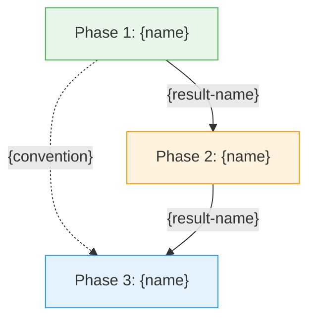

<purpose>
Build and visualize the dependency graph across all research phases. Shows how results flow between phases via provides/requires/affects frontmatter in SUMMARY.md files and phase definitions in ROADMAP.md. Identifies gaps where a phase requires something no other phase provides, and highlights the critical path through the research.
</purpose>

<required_reading>
Read all files referenced by the invoking prompt's execution_context before starting.
</required_reading>

<process>

<step name="load_roadmap">
**Load roadmap and phase inventory:**

```bash
ROADMAP=$(gpd roadmap analyze)
```

Extract: phase list with names, goals, dependencies, and disk status.

**If no roadmap found:**

```
╔══════════════════════════════════════════════════════════════╗
║  ERROR                                                       ║
╚══════════════════════════════════════════════════════════════╝

No ROADMAP.md found. Create a project first:
  /gpd:new-project
```

Exit.

**If fewer than 2 phases:**

```
Only {N} phase found -- dependency graph requires at least 2 phases.
```

Exit.
</step>

<step name="scan_frontmatter">
**Read all SUMMARY.md frontmatter for dependency metadata:**

For each phase directory, find all SUMMARY.md files:

```bash
ls .gpd/phases/*/SUMMARY.md .gpd/phases/*/*-SUMMARY.md 2>/dev/null
```

For each SUMMARY.md, extract YAML frontmatter fields:

- **provides:** List of results/quantities this plan produces (e.g., `effective-hamiltonian`, `dispersion-relation`, `transport-coefficients`)
- **requires:** List of results/quantities this plan needs from earlier phases (e.g., `band-structure`, `coupling-constants`)
- **affects:** List of conventions or definitions established (e.g., `metric-signature`, `normalization-convention`)

Also extract dependency information from ROADMAP.md phase definitions (the `Dependencies:` field for each phase).
</step>

<step name="build_graph">
**Construct the directed dependency graph:**

Nodes: One per phase (labeled `P{N}: {short-name}`)

Edges (three types):

1. **provides -> requires** (solid arrow): Phase A provides X, Phase B requires X -> edge A -> B
2. **ROADMAP dependencies** (solid arrow): Phase B lists Phase A as a dependency -> edge A -> B
3. **affects** (dashed arrow): Phase A affects a convention that Phase B uses -> dashed edge A -> B

Deduplicate edges: if both ROADMAP dependency and provides/requires create the same edge, keep one solid arrow.

For each edge, record the label (what flows: result name, convention, etc.).
</step>

<step name="generate_mermaid">
**Generate Mermaid flowchart:**



**Node styling by status:**

- `complete` -- green: all plans have SUMMARYs
- `partial` -- orange: some plans complete
- `planned` -- blue: plans exist but none executed
- `empty` -- grey: no plans created yet

**Edge styling:**

- Solid arrows (`-->`) for result dependencies (provides/requires)
- Dashed arrows (`-.->`) for convention affects
- Labels show what flows between phases
  </step>

<step name="gap_analysis">
**Identify dependency gaps:**

A gap exists when:

1. **Unmet requires:** A phase requires result X, but no phase provides X
2. **Orphaned provides:** A phase provides result X, but no subsequent phase requires X
3. **Missing phase:** ROADMAP lists a dependency on a phase that doesn't exist
4. **Circular dependency:** Phase A requires B and B requires A (should not happen, but check)

For each gap found, categorize:

| Gap Type          | Severity | Description                                        |
| ----------------- | -------- | -------------------------------------------------- |
| Unmet requires    | High     | Phase {N} requires "{X}" but nothing provides it   |
| Orphaned provides | Low      | Phase {N} provides "{X}" but nothing uses it       |
| Missing phase     | High     | Phase {N} depends on Phase {M} which doesn't exist |
| Circular          | Critical | Phases {N} and {M} have circular dependency        |

</step>

<step name="critical_path">
**Compute the critical path:**

The critical path is the longest chain of sequential dependencies through the graph. Phases on the critical path cannot be parallelized and determine the minimum research timeline.

1. Topological sort all phases by dependencies
2. Find the longest path from any root (no requires) to any leaf (no dependents)
3. Mark phases on the critical path

```
## Critical Path

P{A} -> P{B} -> P{C} -> P{D}

{N} phases on critical path out of {M} total.
Parallelizable phases: {list of phases NOT on critical path}
```

</step>

<step name="present_results">
**Assemble and display the graph report:**

````
━━━━━━━━━━━━━━━━━━━━━━━━━━━━━━━━━━━━━━━━━━━━━━━━━━━━━
 GPD > DEPENDENCY GRAPH
━━━━━━━━━━━━━━━━━━━━━━━━━━━━━━━━━━━━━━━━━━━━━━━━━━━━━

## Phase Overview

| Phase | Name | Status | Provides | Requires |
|-------|------|--------|----------|----------|
{rows for each phase}

## Dependency Graph

```mermaid
{mermaid diagram from step 4}
````

{Copy the mermaid code block above for rendering in any Mermaid-compatible viewer.}

## Gap Analysis

{If no gaps:}
✓ No dependency gaps found. All requires are satisfied.

{If gaps found:}
⚠ {N} dependency gap(s) found:

| #   | Gap Type | Severity | Description |
| --- | -------- | -------- | ----------- |

{gap rows}

## Critical Path

{critical path from step 6}

---

```
</step>

<step name="offer_write">
**Offer to persist the graph:**

```

───────────────────────────────────────────────────────────────

Write this analysis to `.gpd/DEPENDENCY-GRAPH.md`? (y/n)

───────────────────────────────────────────────────────────────

````

**If yes:**

Write the full report to `.gpd/DEPENDENCY-GRAPH.md`.

```bash
PRE_CHECK=$(gpd pre-commit-check --files .gpd/DEPENDENCY-GRAPH.md 2>&1) || true
echo "$PRE_CHECK"

gpd commit "docs: generate dependency graph" --files .gpd/DEPENDENCY-GRAPH.md
````

**After write (or if declined):**

```
───────────────────────────────────────────────────────────────

**Also available:**
- `/gpd:show-phase <N>` -- inspect a specific phase in detail
- `/gpd:plan-phase <N>` -- plan an unstarted phase
- `/gpd:progress` -- overall research progress

───────────────────────────────────────────────────────────────
```

</step>

</process>

<anti_patterns>

- Don't assume dependency order from phase numbering alone -- use explicit provides/requires
- Don't generate broken Mermaid syntax (test node IDs are valid: alphanumeric, no spaces)
- Don't ignore ROADMAP.md dependencies when SUMMARY frontmatter is absent
- Don't report orphaned provides as high severity -- unused results are normal in early phases
- Don't silently skip phases with no SUMMARY -- include them as nodes with planned/empty status
  </anti_patterns>

<success_criteria>
Dependency graph is complete when:

- [ ] All SUMMARY.md frontmatter parsed for provides/requires/affects
- [ ] ROADMAP.md phase dependencies included
- [ ] Directed graph constructed with labeled edges
- [ ] Valid Mermaid diagram generated with status-based coloring
- [ ] Gaps identified (unmet requires, orphaned provides, missing phases)
- [ ] Critical path computed and displayed
- [ ] Results presented in structured report
- [ ] Optional write to .gpd/DEPENDENCY-GRAPH.md offered

</success_criteria>
